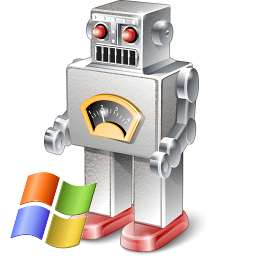
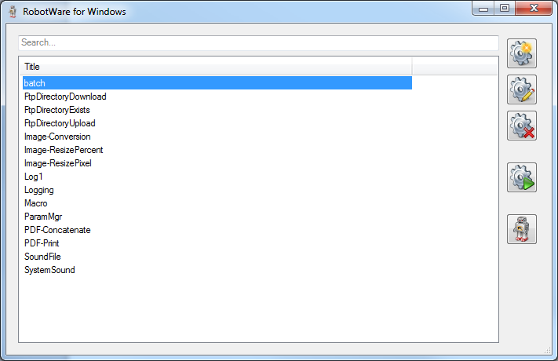
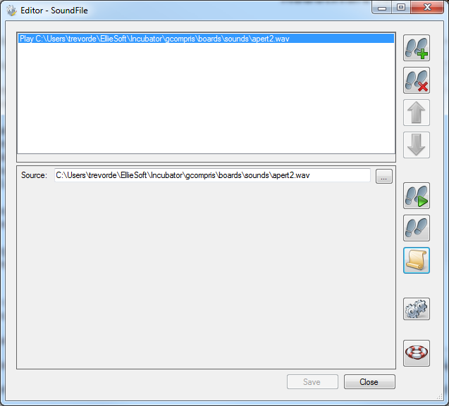
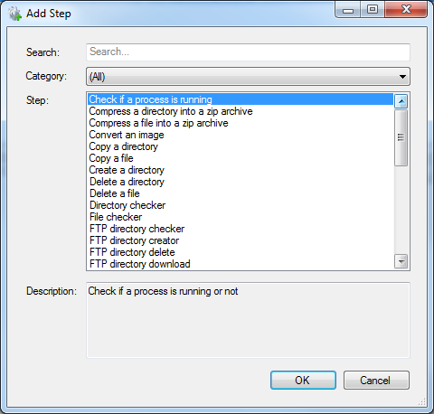
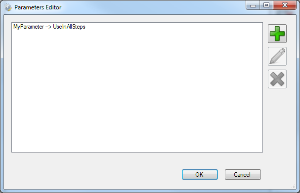
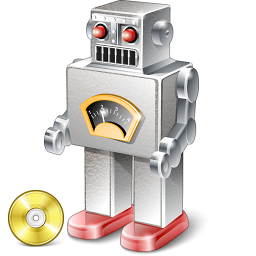

# EllieWare - Code Free Automation

## RobotWare for Windows

_RobotWare for Windows_ - code free automation for _Windows_

_RobotWare for Windows_ is a _Windows_ desktop application to automate various tasks without writing a single line of code.

_RobotWare for Windows_ features:
* simple intuitive interface
* _code free_ environment
* extensive range of steps
* _point and click_ configuration of each step
* parameters to share information between steps
* batch operations to run a series of steps multiple times
* easily add your own steps with _RobotWare SDK_

_RobotWare for Windows_ comes with the following steps:
* local file and directory operations
* FTP file and directory operations
* image conversion and resizing
* PDF file operations
* play sounds
* logging
* process operations

Uses for _RobotWare for Windows_:
* batch resize and rename of image files
* upload and download of files from FTP site
* concatenate PDF files into a single file
* password protect PDF files
* limited only by your imagination!

## RobotWare for SpaceClaim

_RobotWare for SpaceClaim_ - code free automation for _SpaceClaim_

_RobotWare for SpaceClaim_ is a _SpaceClaim_ addin to automate various tasks without writing a single line of code.

_RobotWare for SpaceClaim_ has all the features of _RobotWare for Windows_ and:
* fully integrated inside _SpaceClaim_
* extensive range of _SpaceClaim_ specific steps
* parameters to share information between steps
* batch operations to run a series of steps multiple times
* easily add your own steps with _RobotWare SDK_
* support for shared Specifications in a Workgroup
* integrated _Specification Manager_ in a _SpaceClaim_ panel

_RobotWare for SpaceClaim_ comes all of the steps of _RobotWare for Windows_ and:
* import foreign geometry files
* export foreign geometry files
* export to bitmap, _AutoCAD_ or PDF
* select short edges in your model
* identify small faces in your model
* remove faces below a threshold area in your model
* save all files
* close all files without saving
* manipulate the current view

Uses for _RobotWare for SpaceClaim_:
* batch import and export of native and foreign geometry files
* batch geometry cleanup of models prior to analysis
* batch export to image (or PDF) files
* all the same uses as _RobotWare for Windows_
* limited only by your imagination!

## RobotWare SDK

_RobotWare SDK_ - add your own functions to _RobotWare_

_RobotWare SDK_ is a software development kit to add additional steps to _RobotWare_.

_RobotWare SDK_ features:
* .NET based API
* simple development - just two interfaces to implement
* easy deployment - just place alongside RobotWare
* sample code to get you started

Uses for _RobotWare SDK_:
* extend _RobotWare_ with your own custom functionality
* interact with corporate databases
* manipulate web pages
* use external web services
* limited only by your imagination!

## Other Products

### RobotWare Runtime for SpaceClaim

Features:
* centralise development of macros
* run-only system for clients

### SerpentWare for SpaceClaim

Features:
* _Python_ scripting directly integrated into _SpaceClaim_
* automate _SpaceClaim_ with _Python_
* editor with built-in highlighting
* _IntelliSense_ for all _Python_ and _SpaceClaim_ APIs

### RobotWare for SolidWorks

Features:
* all the functionality of _RobotWare_, integrated in _SolidWorks_
* wide range of _SolidWorks_ specific steps

